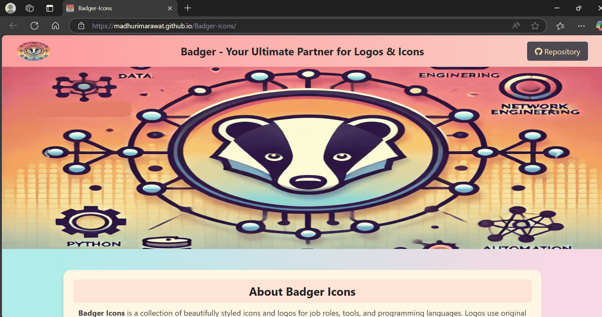
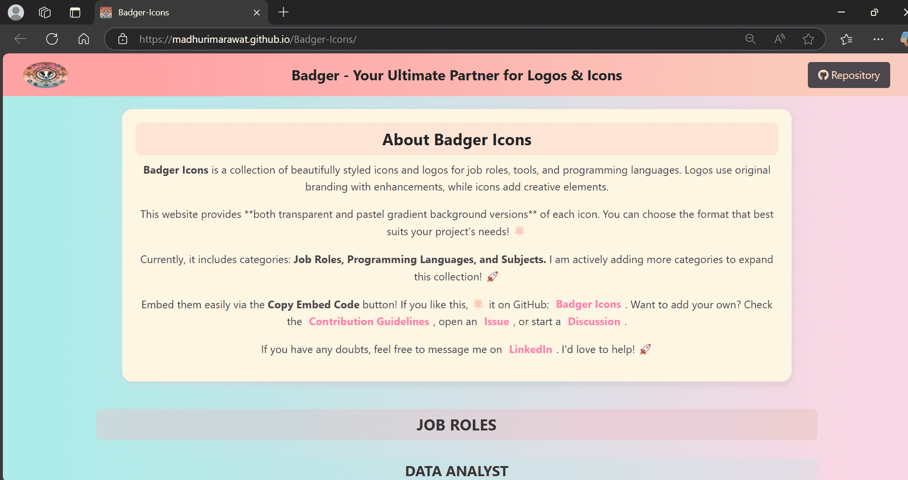
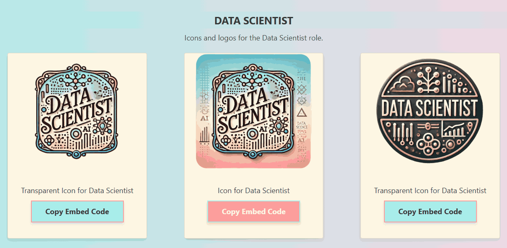
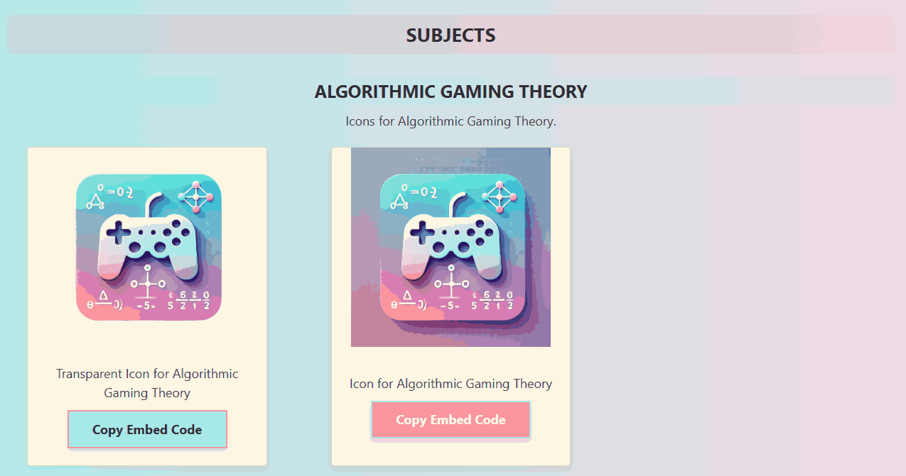

# Badger-Icons
A collection of beautifully styled icons and logos for job roles, tools, and programming languages. Available in both transparent and pastel gradient backgrounds for seamless integration.

<p align="center">

  <!-- Repository Size -->
  <a href="https://github.com/madhurimarawat/Badger-Icons">
    
  </a>

  <!-- Stars -->
  <a href="https://github.com/madhurimarawat/Badger-Icons/stargazers">
    
  </a>

  <!-- Forks -->
  <a href="https://github.com/madhurimarawat/Badger-Icons/network/members">
    
  </a>

  <!-- Issues (Open + Closed) -->
  <a href="https://github.com/madhurimarawat/Badger-Icons/issues">
    
  </a>
  <a href="https://github.com/madhurimarawat/Badger-Icons/issues?q=is%3Aissue+is%3Aclosed">
    
  </a>

  <!-- Pull Requests (Open + Closed) -->
  <a href="https://github.com/madhurimarawat/Badger-Icons/pulls">
    
  </a>
  <a href="https://github.com/madhurimarawat/Badger-Icons/pulls?q=is%3Apr+is%3Aclosed">
    
  </a>

  <!-- Discussions -->
  <a href="https://github.com/madhurimarawat/Badger-Icons/discussions">
    
  </a>

  <!-- Contributors -->
  <a href="https://github.com/madhurimarawat/Badger-Icons/graphs/contributors">
    
  </a>

  <!-- License -->
  <a href="https://github.com/madhurimarawat/Badger-Icons/blob/main/LICENSE">
    
  </a>

  <!-- Last Commit -->
  <a href="https://github.com/madhurimarawat/Badger-Icons/commits/main">
    
  </a>

 <!-- GitHub Pages Deployment -->
<a href="https://github.com/madhurimarawat/Badger-Icons/actions/workflows/pages/pages-build-deployment">
    
</a>

  <!-- Watchers -->
  <a href="https://github.com/madhurimarawat/Badger-Icons/watchers">
    
  </a>
</p>

<p align="center">
  <a href="https://madhurimarawat.github.io/Badger-Icons/">
    
    
    
  </a>
</p>

---

## 🚀 About Badger-Icons  
**Badger-Icons** is a collection of **professionally styled icons and logos** for:  
✔ **Job Roles** 👩‍💻  
✔ **Programming Languages** 🖥️  
✔ **Technical Tools & Subjects** 🎨 

Each icon is available in **two formats**:  
- **Transparent background** 🌟  
- **Pastel gradient background** 🎨 

Perfect for **developers, designers, and educators** to integrate into projects effortlessly!  

---

## 📌 Icons & Logos  

### 🗄️ Databases  
🔗 [View all Database Icons](https://github.com/madhurimarawat/Badger-Icons/tree/main/assets/databases)  

| Database | Transparent Icon | Icon | Transparent Logo | Logo |
|----------|----------------|------|------------------|------|
| **MongoDB** | <a href="https://github.com/madhurimarawat/Badger-Icons/blob/main/assets/databases/mongodb/concept-icon-1-transparent.webp"></a> | <a href="https://github.com/madhurimarawat/Badger-Icons/blob/main/assets/databases/mongodb/concept-icon-1.webp"></a> | - | - |
| **MySQL** | - | - | <a href="https://github.com/madhurimarawat/Badger-Icons/blob/main/assets/databases/mysql/concept-logo-1-transparent.webp"></a> | <a href="https://github.com/madhurimarawat/Badger-Icons/blob/main/assets/databases/mysql/concept-logo-1.webp"></a> |

---

### 🏢 Job Roles  
🔗 [View all Job Roles Icons](https://github.com/madhurimarawat/Badger-Icons/tree/main/assets/job_roles)  

| Job Role         | Transparent Icon | Icon | Transparent Logo | Logo |
|-----------------|----------------|------|------------------|------|
| **AI Researcher** 🤖🧠 | <a href="https://github.com/madhurimarawat/Badger-Icons/blob/main/assets/job_roles/ai_research/concept-icon-1-transparent.webp"></a> <br> <a href="https://github.com/madhurimarawat/Badger-Icons/blob/main/assets/job_roles/ai_research/concept-icon-2-transparent.webp"></a> | <a href="https://github.com/madhurimarawat/Badger-Icons/blob/main/assets/job_roles/ai_research/concept-icon-1.webp"></a> <br> <a href="https://github.com/madhurimarawat/Badger-Icons/blob/main/assets/job_roles/ai_research/concept-icon-2.webp"></a> | <a href="https://github.com/madhurimarawat/Badger-Icons/blob/main/assets/job_roles/ai_research/concept-logo-1-transparent.webp"></a> <br> <a href="https://github.com/madhurimarawat/Badger-Icons/blob/main/assets/job_roles/ai_research/concept-logo-2-transparent.webp"></a> | <a href="https://github.com/madhurimarawat/Badger-Icons/blob/main/assets/job_roles/ai_research/concept-logo-1.webp"></a> <br> <a href="https://github.com/madhurimarawat/Badger-Icons/blob/main/assets/job_roles/ai_research/concept-logo-2.webp"></a> |
| **Data Analyst** | <a href="https://github.com/madhurimarawat/Badger-Icons/blob/main/assets/job_roles/data_analyst/concept-icon-1-transparent.webp"></a> | <a href="https://github.com/madhurimarawat/Badger-Icons/blob/main/assets/job_roles/data_analyst/concept-icon-1.webp"></a> | <a href="https://github.com/madhurimarawat/Badger-Icons/blob/main/assets/job_roles/data_analyst/concept-logo-1-transparent.webp"></a> | <a href="https://github.com/madhurimarawat/Badger-Icons/blob/main/assets/job_roles/data_analyst/concept-logo-1.webp"></a> |
| **Data Engineer** | <a href="https://github.com/madhurimarawat/Badger-Icons/blob/main/assets/job_roles/data_engineer/concept-icon-1-transparent.webp"></a> <br> <a href="https://github.com/madhurimarawat/Badger-Icons/blob/main/assets/job_roles/data_engineer/concept-icon-2-transparent.webp"></a> | <a href="https://github.com/madhurimarawat/Badger-Icons/blob/main/assets/job_roles/data_engineer/concept-icon-1.webp"></a> <br> <a href="https://github.com/madhurimarawat/Badger-Icons/blob/main/assets/job_roles/data_engineer/concept-icon-2.webp"></a> | - | - |
| **Data Scientist** | <a href="https://github.com/madhurimarawat/Badger-Icons/blob/main/assets/job_roles/data_scientist/concept-icon-1-transparent.webp"></a> <br> <a href="https://github.com/madhurimarawat/Badger-Icons/blob/main/assets/job_roles/data_scientist/concept-icon-2-transparent.webp"></a> <br> <a href="https://github.com/madhurimarawat/Badger-Icons/blob/main/assets/job_roles/data_scientist/concept-icon-3-transparent.webp"></a> | <a href="https://github.com/madhurimarawat/Badger-Icons/blob/main/assets/job_roles/data_scientist/concept-icon-1.webp"></a> <br> <a href="https://github.com/madhurimarawat/Badger-Icons/blob/main/assets/job_roles/data_scientist/concept-icon-2.webp"></a> <br> <a href="https://github.com/madhurimarawat/Badger-Icons/blob/main/assets/job_roles/data_scientist/concept-icon-3.webp"></a> | - | - |
| **Network Engineer** | <a href="https://github.com/madhurimarawat/Badger-Icons/blob/main/assets/job_roles/network_engineer/concept-icon-1-transparent.webp"></a> | <a href="https://github.com/madhurimarawat/Badger-Icons/blob/main/assets/job_roles/network_engineer/concept-icon-1.webp"></a> | - | - |

---

### :octocat: Open Source

🔗 [View all Open Source Icons](https://github.com/madhurimarawat/Badger-Icons/tree/main/assets/open_source)

| Project         | Transparent Icon | Icon | Transparent Logo                                                                                                                                                                                                                                                                                                                                                                                                                                                                                                                                                             | Logo                                                                                                                                                                                                                                                                   |
| --------------- | ---------------- | ---- | ---------------------------------------------------------------------------------------------------------------------------------------------------------------------------------------------------------------------------------------------------------------------------------------------------------------------------------------------------------------------------------------------------------------------------------------------------------------------------------------------------------------------------------------------------------------------------- | ---------------------------------------------------------------------------------------------------------------------------------------------------------------------------------------------------------------------------------------------------------------------- |
| **Contributor** | -                | -    | <a href="https://github.com/madhurimarawat/Badger-Icons/blob/main/assets/open_source/contributor/concept-logo-1-transparent.webp"></a>                                                                                                                                                                                                                                                                               | <a href="https://github.com/madhurimarawat/Badger-Icons/blob/main/assets/open_source/contributor/concept-logo-1.webp"></a> |
| **GitHub**      | -                | -    | <a href="https://github.com/madhurimarawat/Badger-Icons/blob/main/assets/open_source/github/concept-logo-1-transparent.webp"></a><br><a href="https://github.com/madhurimarawat/Badger-Icons/blob/main/assets/open_source/github/concept-logo-2-transparent.webp"></a> | -                                                                                                                                                                                                                                                                      |
---

### 💻 Programming Languages  
🔗 [View all Programming Language Icons](https://github.com/madhurimarawat/Badger-Icons/tree/main/assets/programming_languages)  


| Programming Language | Transparent Icon | Icon | Transparent Logo | Logo |
|---------------------|----------------|------|------------------|------|
| **C** | <a href="https://github.com/madhurimarawat/Badger-Icons/blob/main/assets/programming_languages/c/concept-icon-1-transparent.webp"></a> | <a href="https://github.com/madhurimarawat/Badger-Icons/blob/main/assets/programming_languages/c/concept-icon-1.webp"></a> | <a href="https://github.com/madhurimarawat/Badger-Icons/blob/main/assets/programming_languages/c/concept-logo-1-transparent.webp"></a> <br> <a href="https://github.com/madhurimarawat/Badger-Icons/blob/main/assets/programming_languages/c/concept-logo-2-transparent.webp"></a> | <a href="https://github.com/madhurimarawat/Badger-Icons/blob/main/assets/programming_languages/c/concept-logo-1.webp"></a> <br> <a href="https://github.com/madhurimarawat/Badger-Icons/blob/main/assets/programming_languages/c/concept-logo-2.webp"></a> |
| **C++** | <a href="https://github.com/madhurimarawat/Badger-Icons/blob/main/assets/programming_languages/c++/concept-icon-1-transparent.webp"></a> <br> <a href="https://github.com/madhurimarawat/Badger-Icons/blob/main/assets/programming_languages/c++/concept-icon-2-transparent.webp"></a> | <a href="https://github.com/madhurimarawat/Badger-Icons/blob/main/assets/programming_languages/c++/concept-icon-1.webp"></a> <br> <a href="https://github.com/madhurimarawat/Badger-Icons/blob/main/assets/programming_languages/c++/concept-icon-2.webp"></a> | <a href="https://github.com/madhurimarawat/Badger-Icons/blob/main/assets/programming_languages/c++/concept-logo-1-transparent.webp"></a> <br> <a href="https://github.com/madhurimarawat/Badger-Icons/blob/main/assets/programming_languages/c++/concept-logo-2-transparent.webp"></a> | <a href="https://github.com/madhurimarawat/Badger-Icons/blob/main/assets/programming_languages/c++/concept-logo-1.webp"></a> <br> <a href="https://github.com/madhurimarawat/Badger-Icons/blob/main/assets/programming_languages/c++/concept-logo-2.webp"></a> |
| **Python** | <a href="https://github.com/madhurimarawat/Badger-Icons/blob/main/assets/programming_languages/python/concept-icon-1-transparent.webp"></a> <br> <a href="https://github.com/madhurimarawat/Badger-Icons/blob/main/assets/programming_languages/python/concept-icon-2-transparent.webp"></a> | <a href="https://github.com/madhurimarawat/Badger-Icons/blob/main/assets/programming_languages/python/concept-icon-1.webp"></a> <br> <a href="https://github.com/madhurimarawat/Badger-Icons/blob/main/assets/programming_languages/python/concept-icon-2.webp"></a> | <a href="https://github.com/madhurimarawat/Badger-Icons/blob/main/assets/programming_languages/python/concept-logo-1-transparent.webp"></a> | <a href="https://github.com/madhurimarawat/Badger-Icons/blob/main/assets/programming_languages/python/concept-logo-1.webp"></a> |

---

### 📚 Subjects  
🔗 [View all Subject Icons](https://github.com/madhurimarawat/Badger-Icons/tree/main/assets/subjects)  

| Subject | Transparent Icon | Icon |
|---------|----------------|------|
| **Algorithmic Gaming Theory** | <a href="https://github.com/madhurimarawat/Badger-Icons/blob/main/assets/subjects/algorithmic-gaming-theory/concept-icon-1-transparent.webp"></a> | <a href="https://github.com/madhurimarawat/Badger-Icons/blob/main/assets/subjects/algorithmic-gaming-theory/concept-icon-1.webp"></a> |
| **Management Information System** | <a href="https://github.com/madhurimarawat/Badger-Icons/blob/main/assets/subjects/management-information-system/concept-icon-1-transparent.webp"></a> | <a href="https://github.com/madhurimarawat/Badger-Icons/blob/main/assets/subjects/management-information-system/concept-icon-1.webp"></a> |

---

### 🌐 Website Status 

| Status | Transparent Logo 1 | Logo 1 | Transparent Logo 2 | Logo 2 |
|--------|-------------------|--------|-------------------|--------|
| **Active** | <a href="https://raw.githubusercontent.com/madhurimarawat/Badger-Icons/main/assets/website_status/active/concept-logo-1-transparent.webp"></a> | <a href="https://raw.githubusercontent.com/madhurimarawat/Badger-Icons/main/assets/website_status/active/concept-logo-1.webp"></a> | <a href="https://raw.githubusercontent.com/madhurimarawat/Badger-Icons/main/assets/website_status/active/concept-logo-2-transparent.webp"></a> | <a href="https://raw.githubusercontent.com/madhurimarawat/Badger-Icons/main/assets/website_status/active/concept-logo-2.webp"></a> |

### ❌ Error Pages  

| Error Code | Transparent Logo | Logo |
|------------|----------------|------|
| **403 Forbidden** | <a href="https://raw.githubusercontent.com/madhurimarawat/Badger-Icons/main/assets/website_status/403_forbidden/concept-logo-1-transparent.webp"></a> | <a href="https://raw.githubusercontent.com/madhurimarawat/Badger-Icons/main/assets/website_status/403_forbidden/concept-logo-1.webp"></a> |
| **500 Internal Server Error** | <a href="https://raw.githubusercontent.com/madhurimarawat/Badger-Icons/main/assets/website_status/500_internal_server/concept-logo-1-transparent.webp"></a> | <a href="https://raw.githubusercontent.com/madhurimarawat/Badger-Icons/main/assets/website_status/500_internal_server/concept-logo-1.webp"></a> |
| **CORS Error** | <a href="https://raw.githubusercontent.com/madhurimarawat/Badger-Icons/main/assets/website_status/cors/concept-logo-1-transparent.webp"></a> | <a href="https://raw.githubusercontent.com/madhurimarawat/Badger-Icons/main/assets/website_status/cors/concept-logo-1.webp"></a> |
| **404 Not Found** | <a href="https://raw.githubusercontent.com/madhurimarawat/Badger-Icons/main/assets/website_status/error_404/concept-logo-1-transparent.webp"></a> | <a href="https://raw.githubusercontent.com/madhurimarawat/Badger-Icons/main/assets/website_status/error_404/concept-logo-1.webp"></a> |

---

## 🌟 Features  
✅ **Open Source** - Free to use and contribute!  
✅ **High-Quality Icons** - Pixel-perfect and beautifully styled.  
✅ **Easy Embedding** - Copy embed code directly for use.  
✅ **Consistent Aesthetic** - Soft pastel gradients for a modern, elegant look.  
✅ **Regular Updates** - More icons added frequently!  

---

## 📂 Directory Structure  

```markdown
📦 Badger-Icons – Main project directory  
├── 📁 assets – Stores icons, logos, and categorized resources  
│   ├── 📂 databases – Database-related icons  
│   ├── 📂 frameworks – Icons for various frameworks  
│   ├── 📂 job_roles – Icons representing different tech job roles  
│   │   ├── 📂 data_analyst – Icons for Data Analyst role  
│   │   ├── 📂 data_engineer – Icons for Data Engineer role  
│   │   ├── 📂 data_scientist – Icons for Data Scientist role  
│   │   └── 📂 network_engineer – Icons for Network Engineer role  
│   ├── 📂 json – Stores structured directory metadata in JSON format  
│   ├── 📂 programming_languages – Icons categorized by programming languages  
│   │   ├── 📂 C – Icons for C language  
│   │   ├── 📂 C++ – Icons for C++ language  
│   │   └── 📂 Python – Icons for Python language  
│   ├── 📂 subjects – Icons for different academic/technical subjects  
│   │   ├── 📂 algorithmic-gaming-theory – Icons for gaming theory concepts  
│   │   └── 📂 management-information-system – Icons for MIS topics  
│   └── 📂 tools – Icons for various software tools  
├── 🎨 css – Stylesheets for the website  
│   └── index.css – Main stylesheet for styling  
├── 🖼️ images – General website images and illustrations  
│   ├── badger-logo.png – Project logo  
│   ├── banner.png – Website banner  
│   ├── illustration_1.png – Illustration for UI  
│   ├── illustration_2.png – Another illustration  
│   └── illustration_3.png – Additional UI artwork  
├── 🌐 index.html – Main HTML file for the website  
├── 📜 README.md – Project documentation and details  
├── 📜 LICENSE – Open-source license information  
├── ⚡ js – JavaScript files for website functionality  
│   ├── index-local.js – Local JS file for testing  
│   └── index.js – Main JavaScript file  
├── 📝 localhost-setup.md – Guide for setting up the project locally  
└── 📸 website_snapshots – Screenshots of the website  
    ├── website_1.png – Snapshot 1  
    ├── website_2.png – Snapshot 2  
    ├── website_3.png – Snapshot 3  
    ├── website_4.png – Snapshot 4  
    ├── website_5.png – Snapshot 5  
    ├── website_6.png – Snapshot 6  
    ├── website_7.png – Snapshot 7  
    ├── website_8.png – Snapshot 8  
    └── website_working.gif – Animated view of the working site  
```

---

## 📸 Example Usage  

🔗 [Submit your usage](https://github.com/madhurimarawat/Badger-Icons/issues) using our [Example Usage Submission Template](https://github.com/madhurimarawat/Badger-Icons/blob/main/.github/ISSUE_TEMPLATE/example-usage-submission.md)! 🚀  

| **Snapshot** | **Project Name** | **Description** | **Project Link** |
|-------------|----------------|----------------|----------------|
|  | Example Project | Showcasing Badger-Icons in a website layout. | [View Project](https://madhurimarawat.github.io/Badger-Icons/) |
| Add yours here! | Your Project Name | Briefly describe how you used Badger-Icons. | [Submit here](https://github.com/madhurimarawat/Badger-Icons/issues) |

---

## 👥 Contributors  

We appreciate all contributions! Want to contribute? Check out:  
📜 [Contribution Guidelines](https://github.com/madhurimarawat/Badger-Icons/blob/main/CONTRIBUTING.md) | 📩 [Issue Templates](https://github.com/madhurimarawat/Badger-Icons/blob/main/.github/ISSUE_TEMPLATE) | 🔄 [Pull Request Template](https://github.com/madhurimarawat/Badger-Icons/blob/main/.github/PULL_REQUEST_TEMPLATE.md)  

<table>
  <tr>
    <td align="center">
      <a href="https://github.com/madhurimarawat">
        
        <br /><sub><b>Madhurima Rawat</b></sub>
      </a>
      <br />💻 Maintainer
    </td>
    <td align="center">
      <a href="https://github.com/username">
        
        <br /><sub><b>Contributor Name</b></sub>
      </a>
      <br />🎨 Icons & Design
    </td>
  </tr>
</table>    

---

## Website Design  

Below are snapshots showcasing the **Badger Icons** website:  

<p align="center">
  <a href="https://madhurimarawat.github.io/Badger-Icons/">
    
    
    
    
    
    
  </a>
</p>  

This section provides a glimpse into the **Badger Icons** interface, showcasing its design and functionality. Click on any image to explore the website live. 🚀

---

## Thanks for Visiting 😄

- Drop a 🌟 if you find this repository useful.<br><br>
- If you have any doubts or suggestions, feel free to reach me.<br><br>
📫 How to reach me:  &nbsp; [](https://www.linkedin.com/in/madhurima-rawat/) &nbsp; &nbsp;
<a href ="mailto:rawatmadhurima4@gmail.com"> </a><br><br>
- **Contribute and Discuss:** Feel free to open <a href= "https://github.com/madhurimarawat/Badger-Icons/issues">issues 🐛</a>, submit <a href = "https://github.com/madhurimarawat/Badger-Icons/pulls">pull requests 🛠️</a>, or start <a href = "https://github.com/madhurimarawat/Badger-Icons/discussions">discussions 💬</a> to help improve this repository!
